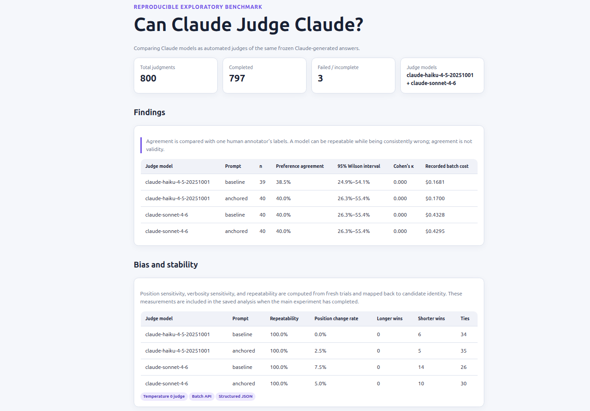

# Claude Judge

## Objetivo

Avaliar com que confiabilidade modelos Claude da Anthropic julgam respostas geradas por Claude em comparação com rótulos humanos. O projeto mede concordância, repetibilidade, viés de posição, sensibilidade à verbosidade e aderência a um rubric de pontuação.

## Stack

- **Modelo/provedor de IA:** Anthropic Claude por meio do SDK oficial da Anthropic para Node.js
- **Linguagem:** JavaScript em Node.js 22+
- **Saída estruturada:** respostas JSON validadas com Zod
- **Testes:** Vitest
- **Artefatos:** dados de benchmark em JSONL e relatório HTML estático

## Metodologia

Este projeto aplica as três técnicas centrais exigidas para a vaga:

1. **Engenharia de prompt:** criação e comparação de prompts congelados — baseline e rubric ancorado — para avaliar a qualidade das respostas.
2. **Saída estruturada em JSON:** solicitação de avaliações legíveis por máquina ao Claude e validação com schemas Zod.
3. **Avaliação da qualidade de respostas de LLM:** comparação dos julgamentos do Claude com rótulos humanos em correção, relevância, completude, alegações sem suporte, preferência, empates, concordância, repetibilidade e viés.

O estudo usa 48 tarefas baseadas em fontes: 8 tarefas de calibração e 40 tarefas reservadas para avaliação, cobrindo perguntas factuais, resumos com restrições, extração estruturada e casos de evidência insuficiente. Haiku e Sonnet geram e congelam as respostas candidatas; depois, os dois modelos julgam as mesmas respostas na temperatura `0`.

Verificações offline:

```bash
npm install
npm test
npm run plan
npm run build:report
```

A execução paga é opt-in com `--execute` e deve permanecer dentro do limite total de `$5` do projeto. Revise [`docs/dataset-review.md`](docs/dataset-review.md) antes de executá-la.

## Resultados da sessão

A imagem dos resultados da sessão de avaliação:



Abra [`public/index.html`](public/index.html) após executar `npm run build:report` para consultar o relatório completo.
